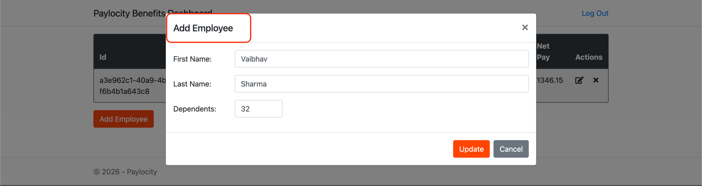

# Bug: The update employee popup title is set to "Add Employee" instead of "Update Employee" when user click on any existing employee from the table on the dashboard.

## Summary:
The update employee popup title is set to "Add Employee" instead of "Update Employee" when user click on any existing employee from the table on the dashboard.

## Pre-requisites:
1. The Paylocity PROD environment is up and running.
2. User should have proper credentials to login to the dashboard.
3. There should be at least one existing employee in the system to perform update action.

## Steps to reproduce:
1. Navigate to the Paylocity dashboard login page.
2. Enter valid Username and valid Password and click on Login.
3. On Homepage, click on any existing employee from the table to open the Update Employee popup.
4. Observe the title of the popup.

## Actual result:
The update employee popup title is set to "Add Employee" instead of "Update Employee".

## Expected result:
The update employee popup title should be set to "Update Employee" when user click on any existing employee from the table on the dashboard.

## Environment:
- OS: MacOs Tahoe 26.3
- Browser: Chrome Version 144.0.7559.134 (Official Build) (arm64)
- Application Version: Paylocity Benefits Dashboard v1.0.0

## Screenshot:
