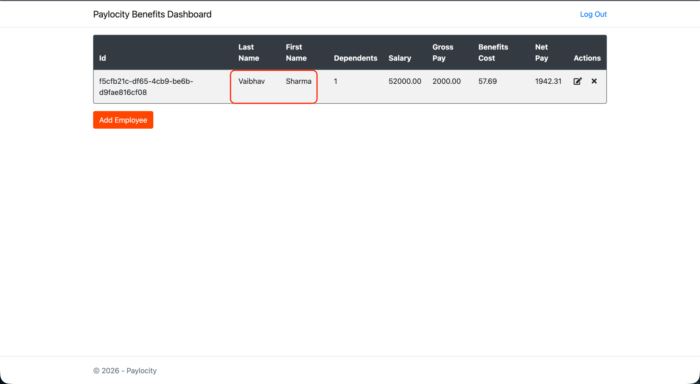

# Bug: The First Name and the Last Name values are swapped inside the table on the Paylocity Benefits dashboard

## Summary:
On the dashboard, the First Name column is showing the lastName and Last Name column showing the firstName of the user

## Pre-requisites:

1. The Paylocity PROD environment is up and running.
2. User should have proper credentials to login to the dashboard.

## Steps to reproduce:

1. Navigate to the Paylocity dashboard login page.
2. Enter valid Username and valid Password and click on Login.
3. On Homepage, click on the Add Employee button.
4. Enter valid First Name, Last Name and Dependents value in respective fields and click on Add button.
5. Once user is created, verify the values in the First Name and Last Name columns.

## Actual result:
The First Name column is showing the lastName and Last Name column showing the firstName of the user.

## Expected result:
The First Name column should show the firstName and Last Name column should show the lastName of the user.

## Environment:
- OS: MacOs Tahoe 26.3
- Browser: Chrome Version 144.0.7559.134 (Official Build) (arm64)
- Application Version: Paylocity Benefits Dashboard v1.0.0

## Screenshot:

