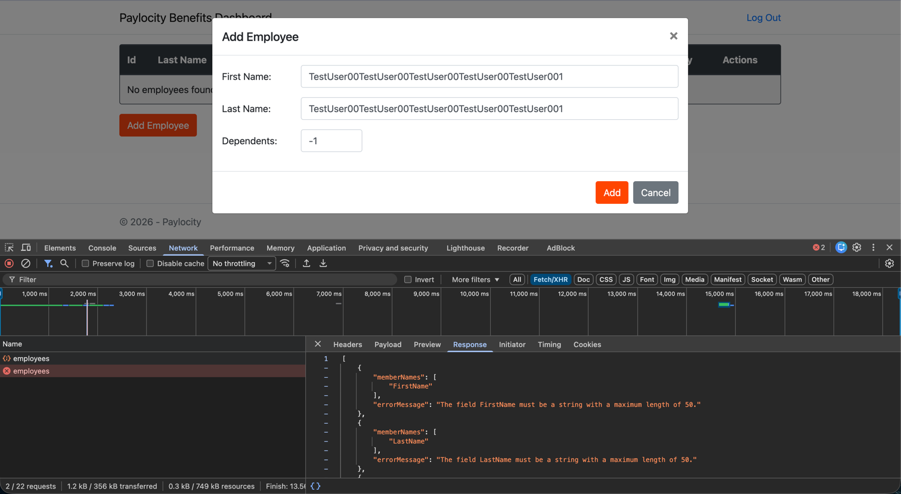
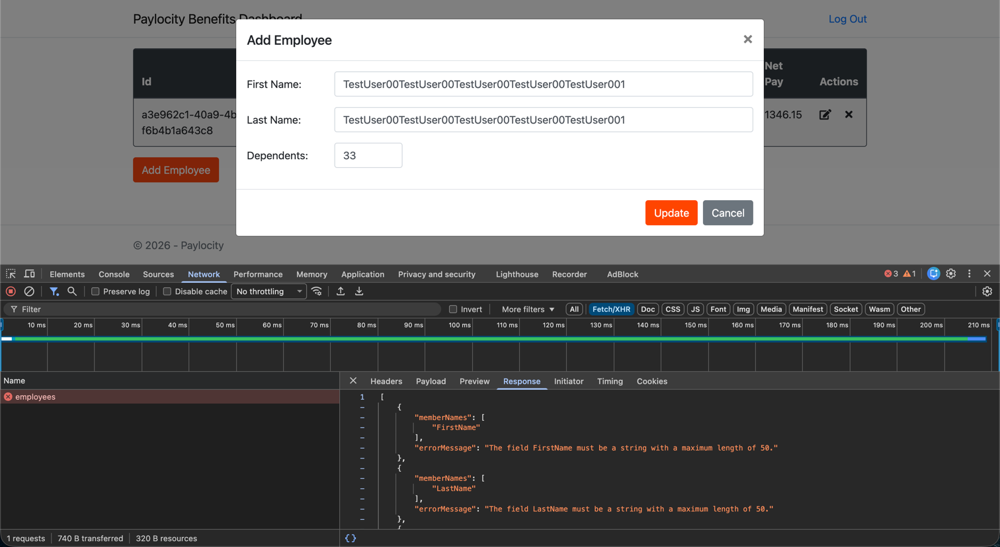

# Bug: No validation message on Add employee or Update employee popup when user try to perform add or update action with invalid details.

## Summary:
No validation message on Add employee or Update employee popup when user try to perform add or update action with invalid details.

## Pre-requisites:
1. The Paylocity PROD environment is up and running.
2. User should have proper credentials to login to the dashboard.
3. For SCENARIO 2, there should be at least one existing employee in the system to perform update action.

# SCENARIO 1: No validation message on Add employee popup when user try to perform add action with invalid details.

## Steps to reproduce:
1. Navigate to the Paylocity dashboard login page.
2. Enter valid Username and valid Password and click on Login.
3. On Homepage, click on the Add Employee button.
4. Enter invalid First Name (More than 50 chars), Last Name (More than 50 chars) and Dependents value (-1 or 33) in 
   respective fields and click on Add.
5. Observe if any validation message is displayed on the popup against respective fields.

## Actual result:
No validation message is displayed on the popup against respective fields and the request fails with 400 Bad Request error.

## Expected result:
Validation message should be displayed on the popup against respective fields and the request should not be sent to the server.
Expected error against respective field:: FirstName should not be more than 50 characters, LastName should not be more
than 50 characters and Dependents value should be between 0 and 32.

## Environment:
- OS: MacOs Tahoe 26.3
- Browser: Chrome Version 144.0.7559.134 (Official Build) (arm64)
- Application Version: Paylocity Benefits Dashboard v1.0.0

Screenshot:

# SCENARIO 2: No validation message on Update employee popup when user try to perform update action with invalid details.

## Steps to reproduce:
1. Navigate to the Paylocity dashboard login page.
2. Enter valid Username and valid Password and click on Login.
3. On Homepage, click on any existing employee from the table to open the Update Employee popup.
4. Enter invalid First Name (More than 50 chars), Last Name (More than 50 chars) and Dependents value (-1 or 33) in 
   respective fields and click on Update.
5. Observe if any validation message is displayed on the popup against respective fields.

## Actual result:
No validation message is displayed on the popup against respective fields and the request fails with 400 Bad Request error.

## Expected result:
Validation message should be displayed on the popup against respective fields and the request should not be sent to the server.
Expected error against respective field:: FirstName should not be more than 50 characters, LastName should not be more than 50 characters and Dependents value should be between 0 and 32.

## Environment:
- OS: MacOs Tahoe 26.3
- Browser: Chrome Version 144.0.7559.134 (Official Build) (arm64)
- Application Version: Paylocity Benefits Dashboard v1.0.0

## Screenshot:

